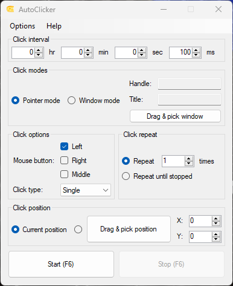

# AutoClicker

Portable auto clicker for Windows

## Features

- Click at a fixed interval, with double click and hold option
- Click at the current mouse position or at a fixed point
- Send clicks to a specific window
- Start/Stop with a configurable hotkey

## Building

- Install Visual Studio 2022 with .NET Framework 4.6 targeting pack.
- Open the solution file `AutoClicker.sln` and build the project.

## Usage

- Run the executable `AutoClicker.exe`.
- Configure the settings.
- Press `Start` button or the hotkey to start clicking.

## Screenshots

## Contributing

Pull requests are welcome. For major changes, please open an issue first to discuss what you would like to change.

## License

This project is licensed under the MIT License - see the [LICENSE](LICENSE) file for details.
